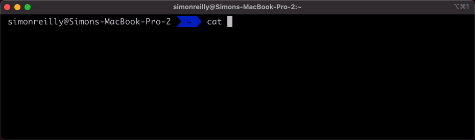

# Go Gitignore It

This project is a golang cli for generating gitignore files.



- [Go Gitignore It](#go-gitignore-it)
  - [Usage](#usage)
  - [Install](#install)
  - [Development](#development)
    - [Dependencies](#dependencies)

## Usage

```bash
ggi <search>
```

## Install

>TODO: Generic install instructions for each platform


## Development

See [Makefile](./Makefile) for commands for testing and building.

### Dependencies

- It utilizes a [fuzzy search](https://github.com/ktr0731/go-fuzzyfinder),
- It packs non go code using [packr](https://github.com/gobuffalo/packr)
